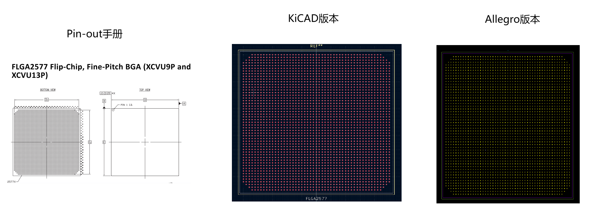

# 手写 BGA 封装是体力活？PolyLibs 帮你一键生成 Xilinx FPGA 的符号与封装

> 做过 FPGA 原理图和 PCB 的都知道，几百个球的 BGA 封装手动建库有多痛苦——引脚名、球号、IO 类型、封装尺寸，任何一个出错就是废板。PolyLibs 这个开源项目解决了这个脏活：选好型号，一键生成 KiCad / Cadence 格式的符号库和封装库，焊盘坐标精确到球号解码，缺省焊盘自动留空。内置 Xilinx 全系列（7series / UltraScale / UltraScale+ / Versal / Zynq），实测 88 个测试用例全绿，Cadence SPB 17.2 上 2577 球的 FLGA2577 封装交互验收通过。

---

## 一、PolyLibs 是什么

PolyLibs 是一个 Xilinx FPGA 原理图符号与 PCB 封装自动生成工具。输入是官方的 pinout CSV 文件，输出是 KiCad 或 Cadence 可用的符号库和封装库。

不是那种「帮你画个框然后自己填引脚」的半自动工具。PolyLibs 自动处理：

- **符号生成**：按引脚功能自动分组（电源、地、IO Bank、MGT、配置），生成左右分区式符号图
- **封装生成**：按球号精确解码坐标，支持缺省焊盘（depopulation），输出丝印框、装配框、占地区
- **多格式输出**：KiCad（`.kicad_sym` + `.kicad_mod`）、Cadence（OrCAD XML + Allegro SKILL 脚本）

内置器件覆盖 Xilinx 当前主流系列：

| 厂商 | 系列 | 说明 |
|------|------|------|
| Xilinx | 7series | A7 / K7 / V7 / S7 等全系 |
| Xilinx | ultrascale | KU / VU / ZU 系列 |
| Xilinx | ultrascale_plus | VU+ / AU+ / ZU+ 等 |
| Xilinx | versal | VC / VE / VM 系列 |
| Xilinx | zynq7000 | Zynq-7000 全系 |
| Xilinx | zynq_us_plus | Zynq UltraScale+ MPSoC |

需要新厂商或新系列，照着 manifest.yaml 模板填上就完事。框架不绑死 Xilinx。

---

## 二、为什么选择 KiCad 和 Cadence 双版本？

PolyLibs 同时支持 KiCad 和 Cadence 两种输出格式，各有各的定位：

| | KiCad | Cadence |
|------|------|------|
| 授权 | 完全开源免费 | 商业 EDA（需 License） |
| 适用场景 | 个人项目、开源硬件、教学、爱好者 | 企业级 PCB 设计、量产产品 |
| 输出格式 | `.kicad_sym` + `.kicad_mod` | OrCAD Library XML + Allegro SKILL |
| 上手难度 | 低，社区资源丰富 | 专业工具，学习曲线陡峭 |
| 验证方式 | kicad-cli 可做自动化验证 | 交互验收（无自动化 CLI 验证） |

**KiCad 是推荐的默认格式**——免费、开源、零门槛。**Cadence 版本面向已有 License 的专业用户**，
帮他们一键生成大型 BGA 封装，免去手动建库的体力活。

> ⚠️ **Cadence License 免责声明：** PolyLibs **不提供** Cadence SPB / OrCAD / Allegro 的商业 License。
> 本工具生成的仅为中间格式文件（XML / SKILL 脚本），需在已合法授权的 Cadence 环境中使用。
> **商业用途请务必自行购买 Cadence License。** 未授权使用可能导致法律风险，开发者不承担任何责任。

---

## 三、为什么手写 BGA 封装是个坑

有过建库经验的同学对下面这些坑应该不陌生：

1. **引脚数量多**：一个 Zynq UltraScale+ 动辄 484 球起，最高到 1760 球。逐一手填，眼睛都花了。
2. **球号编码容易搞错**：BGA 球号字母跳过了 I、O、Q、S、X、Z，AA 之后是 AB 不是 BA。手工写脚本的人经常在这里翻车。
3. **缺省焊盘**：有些球位有焊盘位置但没有引出信号，CSV 里根本没有这个球号。不处理的话生成的封装要么多焊盘要么少焊盘。
4. **长方形封装**：不等 pitch 或非正方形本体，靠启发式猜必然偏。
5. **多工具维护**：KiCad 和 Cadence 格式完全不同，同一型号要手写两套，两套还容易不一样。

PolyLibs 的解法是：一切坐标来自球号解码，不靠几何推测；缺省信息完全从原始 CSV 承载，不自己猜。

---

## 四、焊盘坐标是怎么算的（设计原理）

这部分简短聊聊底层是怎么做的，对于理解输出精度很有帮助。

### 球号解码

每个焊盘的物理坐标由球号直接算出：

- 数字 → 列（X 方向），字母 → 行（Y 方向）
- 行字母按**跳过 I、O、Q、S、X、Z 的 20 进制**计数：A…Y，接着 AA、AB…AY，然后 BA…
- 以阵列中心为原点：`x = (col - col_center) × pitch`，`y = (row_center - row) × pitch`

### 缺省焊盘（depopulation）

生成器只为 pinout CSV 中存在的球号放焊盘。CSV 上没有的阵列位置自然留空，不推测、不插值。缺省信息完全来自原始数据。

实例：**UVBA494** 封装，29 列 × 18 行 = 522 个阵列位置，但只有 494 个有效焊盘，缺的 28 个集中在第 5、25 两列，与实物封装 depopulation 图一致。

### 封装数据库 pkg_db.json

只提供几何参数（pitch、本体尺寸、焊盘/阻焊/钢网直径），不含阵列规模或缺省表。新封装只需补一条 JSON：

```json
"fgg484": {
  "body_size_x": 23.0,
  "body_size_y": 23.0,
  "pitch_mm": 1.0,
  "pad_diameter_mm": 0.45,
  "mask_opening_mm": 0.5,
  "paste_diameter_mm": 0.4
}
```

---

## 五、安装与运行

### 系统要求

- Windows 10/11
- Python 3.10+
- 可选：`kicad-cli`（用于 KiCad 导出验证）

### 三步跑起来

**第一步：克隆**

```bash
git clone https://github.com/Can-Y/PolyLibs.git
cd PolyLibs
```

**第二步：双击 `polylibs.bat`**

首次运行自动创建虚拟环境、安装依赖，然后启动 GUI。什么都不用管。

**第三步：选型号，点生成**

GUI 选厂商 → 系列 → 型号 → 封装 → 勾选 KiCad / Cadence → 生成。

### 批量生成

也可以从命令行批量跑：

```bash
# 生成所有（系列 × 型号 × 封装）组合的 KiCad 库
python batch_generate.py

# 按（系列 × 封装）去重生成封装
python batch_footprints.py
```

输出在 `output/` 目录下，自动按型号组织。

---

## 六、使用示例

### GUI 模式（最常用）

1. 启动 `polylibs.bat`
2. 选：Xilinx → ultrascale_plus → xczu1eg → ubva494
3. 勾选 KiCad + Cadence
4. 点生成

几秒钟后 `output/xczu1egubva494/` 下就有完整的符号和封装文件。

### Cadence 输出怎么用

生成后，`cadence/` 目录下有 `.il` 封装脚本、`_load.txt` 加载说明和 Library XML 符号库。以 **XCVU13P-FLGA2577** 为例：



**Allegro 封装（.il → .dra）**

1. Allegro PCB Editor → `File → New → Package Symbol`
2. 打开 `FLGA2577_load.txt`，复制 `skill load(...)` 命令
3. 在 SKILL 命令行粘贴执行，脚本自动创建 padstack、全部焊盘、外形框、A1 标记
4. `File → Save` 得 `.dra`

**OrCAD 符号（.xml → .olb）**

1. Capture → `File → Import → Library XML`
2. 选 `<型号>_library.xml`
3. 导入后得 `.olb`，打开确认引脚数量与名称

注意：请用交互 GUI 导入，`Capture.exe <script.tcl>` 无头路径会回退到 Lite 模式，单器件超过 100 引脚会被拒绝。

### KiCad 输出

生成后在 KiCad 中直接使用：符号添加到原理图库，封装添加到 `.pretty` 库目录。

---

## 七、验证情况

这是真跑过的，不是「理论上没问题」。

### 自动化测试：88 passed

```bash
cd PolyLibs
.venv/Scripts/python -m pytest -q
```

```
88 passed in 0.52s
```

覆盖了 12 个测试文件，从引脚分类到端到端生成：

| 测试文件 | 用例数 | 说明 |
|----------|--------|------|
| `test_classifier.py` | 11 | 引脚分类规则（电源、地、IO、MGT 等） |
| `test_geometry.py` | 9 | 封装几何计算与数据库查询 |
| `test_parser.py` | 9 | 设备/封装名拆分、CSV 解析 |
| `test_integration.py` | 4 | 端到端生成（7series / UltraScale / UltraScale+） |
| `test_gui.py` | 4 | GUI 构建输出、设备树、生成器注册表 |
| 其他 7 个文件 | 41 | CLI、manifest、模型、新厂商、项目结构、Cadence 脚本等 |
| **合计** | **88** | **全部通过** |

### Manifest 库验证

```bash
.venv/Scripts/python -m polylibs library validate --root ..
```

```
OK: library\xilinx\7series\manifest.yaml
OK: library\xilinx\ultrascale\manifest.yaml
OK: library\xilinx\ultrascale_plus\manifest.yaml
OK: library\xilinx\versal\manifest.yaml
OK: library\xilinx\zynq7000\manifest.yaml
OK: library\xilinx\zynq_us_plus\manifest.yaml
```

7 个 manifest（含 example 示例）全部验证通过。

### Cadence SPB 17.2 实测（重点）

针对 **XCZU1EG-UBVA494**（494 球，29×18 阵列，0.5mm pitch）做了完整的交互验收：

**1. OrCAD 符号（Library XML → .olb）——通过**

- 生成 `XCZU1EGUBVA494_library.xml`（494 引脚）
- Capture 交互 GUI → `File → Import → Library XML` → 导入成功
- 得 `XCZU1EGUBVA494_LIBRARY.OLB`（45 KB），画布目视确认器件本体、左右引脚列、引脚名与球号均正确

**2. Allegro 封装（.il → .dra）——通过**

过程中发现并修复了 3 个问题（SKILL 语法适配、图形创建判空、图纸类型前置检查），修复后：

- 脚本零报错执行，DRC 干净
- `axlPinExport` 导出 494 pin，编号、坐标与预期零偏差
- Padstack 报表确认：TOP/SOLDERMASK/PASTEMASK 三层圆形焊盘 0.2500/0.3000/0.2000 mm，与 `pkg_db.json` 规格一致
- 图形验证：PLACE_BOUND/SILKSCREEN/ASSEMBLY 三个矩形框、REF* 文字、A1 圆圈经代码验证与画布目视确认

### 生成器输出一致性验证

以 KiCad 封装为例，使用 `verify_footprint.py` 比对：

```bash
python verify_footprint.py <封装>.kicad_mod <body_x> <body_y>
```

检查：焊盘跨度 ≤ 本体尺寸，且四边留白大致对称。

---

## 八、技术边界（当前版本的限制）

诚实地说一下现在还处理不了的场景：

- 焊盘阵列中心相对本体中心有偏移（整行/整列缺省导致中心偏移半个 pitch）
- X/Y 方向不等 pitch（当前 schema 仅支持单一 `pitch_mm`）
- 非矩形本体（开槽、切角、裸焊盘 EPAD）
- 非 BGA 编号（QFN/QFP 纯数字引脚）

需要这些特性的同学可以提 issue 或 PR，框架支持扩展。

---

## 九、新增器件教程（60 秒版）

想加一个新系列？三步：

**1. 放原始 CSV**

```
pinout_file/<vendor>/<series>/<data_dir>/*.csv
```

**2. 写 manifest**

```yaml
vendor:
  id: xilinx
  name: Xilinx
series:
  id: my_new_series
  name: MyNewSeries
  classification: classification_rules.yaml
column_map:
  pin_name: Pin
  ball: Ball
  pin_function: "IO Type"
data_dirs:
  - pinout_file/xilinx/my_new_series/data
```

**3. 验证**

```bash
.venv/Scripts/python -m polylibs library validate --root ..
```

OK 后 GUI 里就能看到新系列。

---

## 十、总结

PolyLibs 解决的是一个具体而高频的痛点：FPGA 库文件建库。不搞大而全，只做 BGA 符号与封装生成这一件事，但把它做透。

几个亮点：

- **一键生成**：双击运行，选型号，点生成。没有复杂的命令行配置
- **坐标精确**：球号解码方案，不依靠启发式猜
- **实测验证**：88 测试全绿，Cadence SPB 17.2 交互验收通过
- **双工具输出**：KiCad + Cadence，一套配置同时出两套库
- **开源可扩展**：Apache 2.0 协议，代码在 GitHub，欢迎 PR

项目地址：

- GitHub: https://github.com/Can-Y/PolyLibs
- Gitee: https://gitee.com/yocan/PolyLibs

如果你也受够了手填几百个 BGA 焊盘的体力活，可以试试看。

---

*本文基于 PolyLibs opensource 版本撰写，验证数据来自 2026-07-17 的实测报告。*
